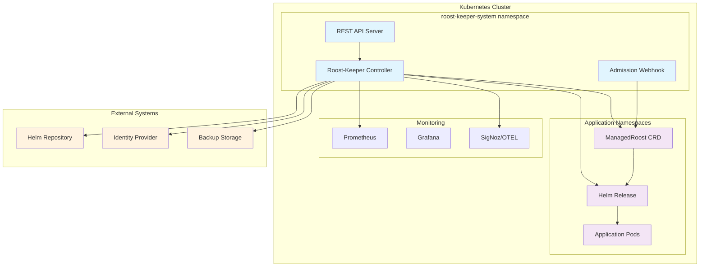

# Roost-Keeper Documentation

[](https://golang.org/dl/)
[](../LICENSE)
[](https://roost.birb.party)

Welcome to Roost-Keeper - the advanced Kubernetes operator for intelligent Helm lifecycle management with comprehensive health monitoring and automated teardown policies.

## Quick Start

### Installation
```bash
# Add the Helm repository
helm repo add roost-keeper https://charts.roost-keeper.io
helm repo update

# Install with default configuration
helm install roost-keeper roost-keeper/roost-keeper \
  --namespace roost-keeper-system \
  --create-namespace

# Verify installation
kubectl get pods -n roost-keeper-system
```

### Create Your First ManagedRoost
```yaml
apiVersion: roost-keeper.io/v1alpha1
kind: ManagedRoost
metadata:
  name: my-first-roost
  namespace: default
spec:
  chart:
    name: nginx
    repository:
      url: https://charts.bitnami.com/bitnami
    version: "13.2.23"
  healthChecks:
    - name: http-health
      type: http
      http:
        url: "http://my-first-roost.default.svc.cluster.local"
        expectedCodes: [200]
      interval: 30s
      timeout: 10s
  teardownPolicy:
    triggers:
      - type: timeout
        timeout: 1h
```

```bash
kubectl apply -f my-first-roost.yaml
kubectl get managedroost my-first-roost -w
```

## Documentation Sections

### 📚 [User Guide](user-guide/)
Essential guides for platform engineers and DevOps teams
- [Installation Guide](user-guide/installation.md) - Complete setup instructions
- [Configuration Reference](user-guide/configuration.md) - All configuration options
- [Health Checks](user-guide/health-checks.md) - Multi-protocol health monitoring
- [Teardown Policies](user-guide/teardown-policies.md) - Automated lifecycle management
- [Multi-tenancy](user-guide/multi-tenancy.md) - Enterprise tenant isolation
- [Security](user-guide/security.md) - RBAC and security hardening
- [Monitoring](user-guide/monitoring.md) - Observability and alerting

### 🔧 [CLI Reference](cli/)
Complete command-line interface documentation
- [Installation](cli/installation.md) - CLI setup and configuration
- [Commands](cli/commands.md) - All available commands
- [Configuration](cli/configuration.md) - CLI configuration options
- [Examples](cli/examples.md) - Common usage patterns

### 🚀 [Tutorials](tutorials/)
Step-by-step learning experiences
- [Getting Started](tutorials/getting-started.md) - Your first 30 minutes with Roost-Keeper
- [Multi-Environment Deployments](tutorials/multi-environment.md) - Dev/staging/prod workflows
- [Advanced Health Monitoring](tutorials/advanced-health.md) - Complex health scenarios
- [Enterprise Integration](tutorials/enterprise-integration.md) - Production deployment patterns

### 📖 [API Reference](api/)
Complete API documentation for developers
- [ManagedRoost API](api/managedroost.md) - Core CRD specification
- [REST API](api/rest-api.md) - HTTP API endpoints
- [Webhooks](api/webhooks.md) - Admission and validation webhooks
- [Events](api/events.md) - Event-driven integration patterns

### 🏗️ [Developer Guide](developers/)
Resources for contributors and advanced users
- [Architecture Overview](developers/architecture.md) - System design and components
- [Contributing](developers/contributing.md) - How to contribute to the project
- [Development Environment](developers/development.md) - Local development setup
- [Testing](developers/testing.md) - Testing strategies and tools

### 🔍 [Troubleshooting](troubleshooting/)
Support and problem-solving resources
- [Common Issues](troubleshooting/common-issues.md) - Frequently encountered problems
- [Performance Issues](troubleshooting/performance.md) - Performance optimization
- [Debugging Guide](troubleshooting/debugging.md) - Advanced debugging techniques
- [Support](troubleshooting/support.md) - Getting help and filing issues

### 📋 [Examples](examples/)
Real-world configuration examples and use cases
- [Basic Deployments](examples/basic/) - Simple, common scenarios
- [Advanced Use Cases](examples/advanced/) - Complex configurations
- [Enterprise Scenarios](examples/enterprise/) - Production-ready patterns
- [Integration Patterns](examples/integrations/) - Third-party integrations

## Key Features

### 🔍 **Multi-Protocol Health Checks**
Monitor your applications with comprehensive health checking:
- **HTTP/HTTPS**: Custom headers, status codes, response validation
- **TCP/UDP**: Socket connectivity and protocol validation
- **gRPC**: Native gRPC health checking with streaming support
- **Prometheus**: Metrics-based health evaluation with trend analysis
- **Kubernetes**: Native resource condition monitoring
- **Composite Logic**: AND/OR combinations with weighted scoring

### ⚡ **Intelligent Lifecycle Management**
Automated teardown with configurable policies:
- **Time-based**: TTL and scheduled teardown
- **Health-based**: Automatic removal on persistent failures
- **Resource-based**: CPU, memory, and storage thresholds
- **Webhook-triggered**: External system integration
- **Manual approval**: Protected teardown workflows

### 🏢 **Enterprise Features**
Production-ready capabilities for large organizations:
- **Multi-tenancy**: Namespace isolation and resource quotas
- **RBAC Integration**: Fine-grained access control
- **Security Hardening**: Pod security standards and network policies
- **High Availability**: Multi-replica deployment with rolling updates
- **Observability**: OpenTelemetry integration with metrics and tracing

### 🔒 **Security & Compliance**
Built-in security features:
- **Admission Webhooks**: Validation and mutation of resources
- **TLS Certificate Management**: Automatic certificate rotation
- **Secret Integration**: Secure credential management
- **Policy Validation**: Automated compliance checking
- **Audit Logging**: Complete audit trail

## Architecture Overview



## Use Cases

### Development Environments
- **Ephemeral Testing**: Automatic cleanup of test deployments
- **Feature Branches**: Isolated environments per Git branch
- **Cost Optimization**: Resource-based teardown policies

### Staging Environments
- **Integration Testing**: Health-based lifecycle management
- **Performance Testing**: Automated teardown after test completion
- **Demo Environments**: Time-based cleanup with manual override

### Production Environments
- **Canary Deployments**: Health-monitored gradual rollouts
- **Disaster Recovery**: Multi-region failover scenarios
- **Compliance**: Audit trails and policy enforcement

## Getting Help

### Community Resources
- 🌟 [GitHub Repository](https://github.com/birbparty/roost-keeper)
- 💬 [Community Discussions](https://github.com/birbparty/roost-keeper/discussions)
- 🐛 [Issue Tracker](https://github.com/birbparty/roost-keeper/issues)
- 📧 [Mailing List](mailto:community@roost-keeper.io)

### Professional Support
- 📞 [Enterprise Support](https://roost-keeper.io/support)
- 🎓 [Training Programs](https://roost-keeper.io/training)
- 🏢 [Consulting Services](https://roost-keeper.io/consulting)

### Learning Resources
- 🎥 [Video Tutorials](https://www.youtube.com/c/roost-keeper)
- 📚 [Blog Posts](https://blog.roost-keeper.io)
- 🎤 [Webinar Series](https://roost-keeper.io/webinars)
- 📖 [Best Practices Guide](https://roost-keeper.io/best-practices)

## What's Next?

### New to Roost-Keeper?
1. 📖 [Follow the Installation Guide](user-guide/installation.md)
2. 🎯 [Complete the Getting Started Tutorial](tutorials/getting-started.md)
3. 🔍 [Explore Example Configurations](examples/)

### Ready for Production?
1. 🏢 [Read the Enterprise Integration Guide](tutorials/enterprise-integration.md)
2. 🔒 [Configure Security Features](user-guide/security.md)
3. 📊 [Set up Monitoring and Alerting](user-guide/monitoring.md)

### Want to Contribute?
1. 🏗️ [Understand the Architecture](developers/architecture.md)
2. 🤝 [Read the Contributing Guide](developers/contributing.md)
3. 🧪 [Set up the Development Environment](developers/development.md)

---

**Built with ❤️ by the birbparty team**

*Roost-Keeper is open source software licensed under the Apache License 2.0*
