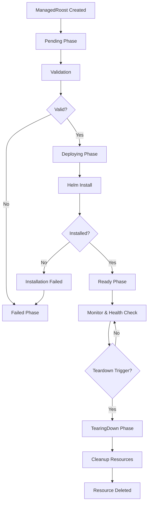

# Basic Lifecycle Management Implementation

## Overview

This document describes the implementation of the basic lifecycle management system for Roost-Keeper, which orchestrates the complete journey from ManagedRoost creation to healthy operation to teardown.

## Architecture

### Core Components

#### 1. Lifecycle Manager (`internal/lifecycle/manager.go`)
The central orchestrator that handles all lifecycle operations:

- **State Machine Management**: Manages phase transitions (Pending → Deploying → Ready → TearingDown)
- **Teardown Policy Engine**: Evaluates all trigger types (timeout, failure_count, resource_threshold, schedule, webhook)
- **Resource Tracking**: Monitors roost creation, deployment status, and cleanup
- **Event Generation**: Emits detailed operational events for visibility
- **Garbage Collection**: Detects and cleans up orphaned resources

#### 2. Lifecycle Metrics (`internal/lifecycle/metrics.go`)
Comprehensive metrics for observability:

- Phase transition tracking and duration
- Teardown trigger activations by type
- Resource cleanup success/failure rates
- Lifecycle operation timing and performance

#### 3. Enhanced Controller Integration
The ManagedRoost controller now integrates with the lifecycle manager for:

- Centralized lifecycle processing
- Better status condition management
- Comprehensive error handling and recovery
- Enhanced event emission

## Features Implemented

### ✅ Core Lifecycle Management

1. **State Machine Processing**
   - Clean phase transitions through all lifecycle phases
   - Proper status tracking and condition management
   - Event generation for operational visibility

2. **Resource Tracking**
   - Monitors roost creation and initialization
   - Tracks Helm deployment status and progress
   - Updates status based on real deployment state

3. **Teardown Policy Evaluation**
   - **Timeout Triggers**: Teardown after specified duration
   - **Failure Count Triggers**: Teardown after repeated failures
   - **Resource Threshold Triggers**: Teardown when resource usage exceeds limits
   - **Schedule Triggers**: Cron-based teardown scheduling
   - **Webhook Triggers**: External teardown notifications via annotations

4. **Resource Cleanup**
   - Comprehensive Helm release cleanup
   - Operator-managed resource cleanup
   - Progress tracking during teardown
   - Graceful failure handling

5. **Observability Integration**
   - Lifecycle-specific metrics with OpenTelemetry
   - Detailed tracing for all operations
   - Event recording for operational visibility
   - Error classification and monitoring

### 🔄 Lifecycle Flow



### 📊 Metrics Available

The lifecycle manager exposes comprehensive metrics:

```bash
# Lifecycle operations
roost_keeper_lifecycle_operations_total
roost_keeper_lifecycle_duration_seconds

# Roost lifecycle tracking
roost_keeper_roosts_created_total
roost_keeper_roosts_by_phase
roost_keeper_phase_transitions_total

# Teardown monitoring
roost_keeper_teardowns_triggered_total
roost_keeper_teardown_triggers_total
roost_keeper_cleanup_operations_total

# Garbage collection
roost_keeper_garbage_collections_total
roost_keeper_orphaned_resources_total
```

## Usage Examples

### Basic ManagedRoost with Timeout Teardown

```yaml
apiVersion: roost.birb.party/v1alpha1
kind: ManagedRoost
metadata:
  name: example-roost
  namespace: default
spec:
  chart:
    repository:
      url: "https://charts.bitnami.com/bitnami"
    name: "nginx"
    version: "15.4.4"
  teardownPolicy:
    triggers:
      - type: timeout
        timeout: "1h"
```

### ManagedRoost with Multiple Teardown Triggers

```yaml
apiVersion: roost.birb.party/v1alpha1
kind: ManagedRoost
metadata:
  name: advanced-roost
  namespace: default
spec:
  chart:
    repository:
      url: "https://charts.bitnami.com/bitnami"
    name: "postgresql"
    version: "12.12.10"
  teardownPolicy:
    triggers:
      - type: timeout
        timeout: "2h"
      - type: failure_count
        failureCount: 5
      - type: schedule
        schedule: "0 2 * * *"  # Daily at 2 AM
  healthChecks:
    - name: "postgres-health"
      type: "tcp"
      tcp:
        host: "advanced-roost-postgresql"
        port: 5432
      interval: "30s"
      timeout: "10s"
```

### Webhook-Triggered Teardown

```bash
# Trigger teardown via annotation
kubectl annotate managedroost example-roost \
  roost-keeper.io/teardown-trigger="external-signal: maintenance-window"
```

## Integration Tests

Comprehensive integration tests validate:

1. **Basic Lifecycle Flow**: Creation → Ready → Deletion
2. **Timeout Teardown**: Automatic teardown after timeout
3. **Failure Recovery**: Proper handling of deployment failures
4. **Health Check Integration**: Health monitoring during operation
5. **Metrics Recording**: Proper metric emission
6. **Resource Cleanup**: Complete cleanup during deletion

```bash
# Run lifecycle integration tests
go test ./test/integration/ -run TestLifecycle -v

# Run specific test scenarios
go test ./test/integration/ -run TestLifecycleTimeoutTeardown -v
go test ./test/integration/ -run TestLifecycleFailureRecovery -v
```

## Monitoring and Observability

### Key Metrics to Monitor

1. **Phase Transition Health**
   ```promql
   rate(roost_keeper_phase_transitions_total[5m])
   ```

2. **Teardown Trigger Frequency**
   ```promql
   rate(roost_keeper_teardown_triggers_total[1h]) by (trigger_type)
   ```

3. **Lifecycle Operation Duration**
   ```promql
   histogram_quantile(0.95, roost_keeper_lifecycle_duration_seconds)
   ```

4. **Resource Cleanup Success Rate**
   ```promql
   rate(roost_keeper_cleanup_operations_total[5m])
   ```

### Event Monitoring

Watch for key lifecycle events:

```bash
# Monitor phase transitions
kubectl get events --watch --field-selector reason=PhaseTransition

# Monitor teardown triggers
kubectl get events --watch --field-selector reason=TeardownTriggered

# Monitor cleanup completion
kubectl get events --watch --field-selector reason=CleanupCompleted
```

## Advanced Configuration

### Teardown Policy Types

1. **Timeout-based**
   ```yaml
   teardownPolicy:
     triggers:
       - type: timeout
         timeout: "30m"
   ```

2. **Failure-based**
   ```yaml
   teardownPolicy:
     triggers:
       - type: failure_count
         failureCount: 3
   ```

3. **Resource threshold-based**
   ```yaml
   teardownPolicy:
     triggers:
       - type: resource_threshold
         resourceThreshold:
           memory: "500Mi"
           cpu: "200m"
   ```

4. **Schedule-based**
   ```yaml
   teardownPolicy:
     triggers:
       - type: schedule
         schedule: "0 */6 * * *"  # Every 6 hours
   ```

### Data Preservation

```yaml
teardownPolicy:
  dataPreservation:
    enabled: true
    backupPolicy:
      schedule: "0 1 * * *"
      retention: "7d"
    preserveResources:
      - "PersistentVolumeClaim"
      - "Secret"
```

## Troubleshooting

### Common Issues

1. **Roost Stuck in Deploying Phase**
   ```bash
   # Check Helm release status
   kubectl get managedroost example-roost -o yaml
   
   # Check events
   kubectl describe managedroost example-roost
   ```

2. **Teardown Not Triggering**
   ```bash
   # Verify teardown policy configuration
   kubectl get managedroost example-roost -o jsonpath='{.spec.teardownPolicy}'
   
   # Check controller logs
   kubectl logs -n roost-keeper-system deployment/roost-keeper-controller
   ```

3. **Cleanup Failures**
   ```bash
   # Check teardown status
   kubectl get managedroost example-roost -o jsonpath='{.status.teardown}'
   
   # Manual cleanup if needed
   kubectl patch managedroost example-roost --type='merge' -p='{"metadata":{"finalizers":null}}'
   ```

## Performance Considerations

### Scaling Guidelines

- **Concurrent Reconciles**: Default 10, can be increased for high-throughput scenarios
- **Requeue Intervals**: 
  - Fast: 30 seconds (for active operations)
  - Default: 5 minutes (for monitoring)
  - Slow: 10 minutes (for failed states)

### Resource Requirements

- **Memory**: ~50MB base + ~5MB per 100 active roosts
- **CPU**: Minimal during normal operation, bursts during phase transitions
- **Network**: Primarily Kubernetes API calls and Helm operations

## Future Enhancements

### Planned Features

1. **Advanced Resource Threshold Monitoring**
   - Integration with Prometheus metrics
   - Custom resource usage queries
   - Multi-dimensional threshold evaluation

2. **Enhanced Schedule Triggers**
   - Full cron expression parsing
   - Timezone support
   - Schedule dry-run validation

3. **Webhook Integration**
   - Dedicated webhook server
   - Authentication and authorization
   - Custom webhook payload processing

4. **Backup Integration**
   - Automated backup creation before teardown
   - Integration with backup operators
   - Restore capabilities

## Conclusion

The basic lifecycle management system provides a robust foundation for managing ManagedRoost lifecycles with comprehensive observability, flexible teardown policies, and reliable resource cleanup. The system is designed to scale efficiently and provide operational teams with the visibility and control needed to manage ephemeral infrastructure at scale.
